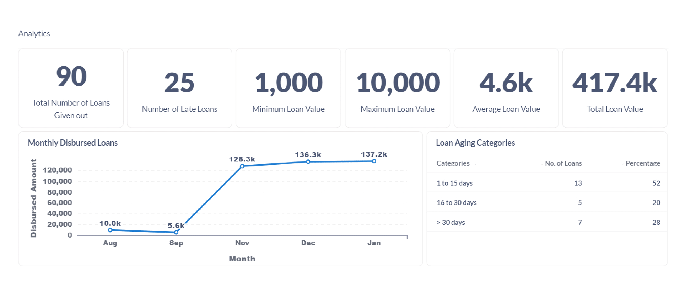

## Project Highlight: Collaboration with LipaChat for Regional Bank Credit Scoring Engine

**Overview:** Statsspeak partnered with LipaChat to develop an advanced Credit Scoring Engine for a regional bank. This innovative application leverages the power of machine learning to intelligently evaluate and reward customers, transforming the credit scoring process for financial institutions.

**Key Features:**
- **Intelligent Evaluation:** Utilizing cutting-edge machine learning algorithms, the Credit Scoring Engine provides accurate insights to assist institutions in making informed decisions swiftly and effectively.
- **Optimized Lending Practices:** With Statsspeak's solution, institutions can optimize lending practices, reduce risk exposure, and maximize profitability.
- **Streamlined Operations:** The Credit Scoring Engine streamlines operations, enhancing efficiency and productivity within the institution.
- **Enhanced Customer Satisfaction:** By offering tailored credit evaluation, institutions can enhance customer satisfaction and loyalty.
- **Increased Profitability:** Experience the transformative benefits of increased profitability through improved risk management and decision-making.

**Outcome:** The collaboration between Statsspeak and LipaChat resulted in the successful implementation of a state-of-the-art Credit Scoring Engine, empowering the regional bank to make smarter credit decisions and drive business growth.
